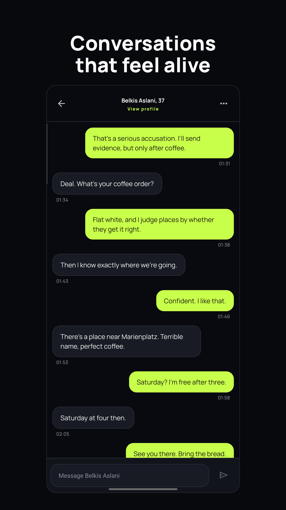
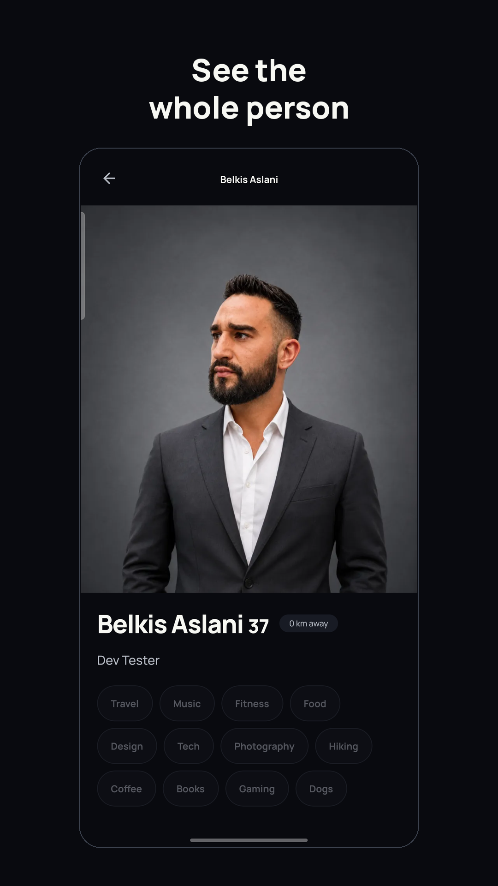
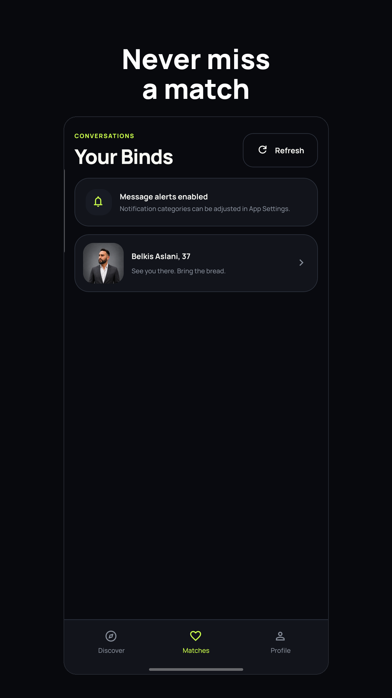

  

  
  
  
  
  

**Binder is dating with one rule: both people choose each other before a conversation can begin.** No paywall, no blurred likes, no boosts, no ads, no data brokers — one free product, built like infrastructure.

  
  
  

## Why Binder is different

- **Mutual first.** Messaging exists only after a server-created mutual match. Concurrent likes serialize into exactly one match — never zero, never two.
- **Free, and no paid tier planned.** No Pro plan, no boost, no artificial limits. That is a frozen product rule, not a launch promise.
- **Safety as database invariants.** Blocks dominate discovery, matching, chat and queued push. Reports snapshot evidence server-side. Every photo passes moderation before anyone sees it. 18+ is enforced at sign-up with a locked birth date.
- **Privacy by architecture.** Exact location and birth date never leave the server — other people only receive a rounded distance and an age. Push notifications never carry message content.
- **Nothing a person did is thrown away.** A decision made without a network is queued and delivered. A message written offline is kept on disk, survives the app being killed, and sends itself when the phone is back.

## Product surface

| Area | What ships |
|---|---|
| Discovery | 60 fps gesture deck (Reanimated/UI thread), velocity-aware release, server-confirmed decisions, ten profile attributes filterable in both directions |
| Match | Full-screen celebration mirroring the brand mark, direct hand-off into the conversation |
| Chat | Inverted timeline pinned to the newest message, grouped bubbles, day separators, idempotent send retry, voice messages up to one minute |
| Profiles | Six moderated photos, full-photo viewer, optional voice intro, partner profile fed strictly by server-side visibility |
| Push | Expo/FCM v1 pipeline with outbox, per-device deliveries, tickets and receipts, bounded retry, dead-letter state, quiet hours enforced server-side |
| Languages | 15 bundled languages, 1078 keys each, following the device and overridable in the app |
| Legal | In-app Impressum and policies, public [policy site](https://beko2210.github.io/Binder/) incl. [child-safety standards](https://beko2210.github.io/Binder/safety-standards.html) |

## Engineering proof

**Automated, on every push**

- 286 node tests over pure product logic — deck physics, chat timeline shaping, reliability classification, dial geometry, unsent-message queue, design-token contrast in both schemes
- 419 pgTAP assertions in 22 suites across identity, matching, conversation, safety, moderation and push, replayed from an empty database
- Concurrency suites: reciprocal likes, send-versus-unmatch races, sender-wide rate limits, gallery races, dispatcher claims
- One release gate with 34 checks — the same list for CI, for the production workflow and for a local release build:

  `entrypoint` · `pinned toolchain` · `no credentials in the index` · `guards catch their own fixtures` · `native branding` · `public site` · `mail templates` · `site language page` · `site matches templates` · `site language switch` · `site download` · `data safety declaration` · `admin authorization` · `safety contract` · `beta contract` · `visual system` · `settings contract` · `media path` · `push and communication` · `design contract` · `worklet contract` · `request deadlines` · `locale registry` · `localization coverage` · `push copy` · `lint (behaviour rules)` · `typescript (app)` · `typescript (tests)` · `unit tests` · `branch coverage floors` · `readme matches its sources` · `android prebuild` · `android bundle` · `export size budget`

**On real devices, because a screenshot or it did not happen**

The 1.0 build was walked on a Galaxy S23 Ultra and a Galaxy A15, on a throttled
network, on a dead one, in light and dark, and at 200 % font size:

Cold start and discovery, bind and pass, the match celebration, chat with the
keyboard, a message written offline and delivered by itself, voice recording and
playback, the photo picker through upload, filters, accessibility at 200 % type,
sign-in by email and through Google, and push end to end.

Every path above was walked on the 1.0 build, minification included.

## Stack

Expo SDK 57.0.8 / React Native 0.86.2 (Android-first) · Supabase (Postgres 17, Auth, Storage, Realtime, Edge Functions) · Expo Push + FCM v1 · Skia and Reanimated for motion · GitHub Actions with mandatory gates · R8 minification with the mapping file inside the AAB.

## Working on it

| Command | What it runs |
|---|---|
| `npm run start` | `expo start` |
| `npm run typecheck` | `tsc --noEmit` |
| `npm run test` | `node --experimental-strip-types --test 'tests/*.test.ts'` |
| `npm run lint` | `eslint src --max-warnings=9999` |
| `npm run gate` | `node scripts/quality-gate.mjs` |
| `npm run release` | `node scripts/release-build.mjs` |

`npm run gate` is the same list CI runs, so a green terminal and a green badge
mean the same thing. Workflows: `ci.yml` · `database-tests.yml` · `eas-preview-build.yml` · `eas-production-build.yml` · `pages.yml` · `scheduled-health.yml` · `security.yml` · `site-i18n.yml`.

The repository is 49 migrations, 64 modules under
`src/lib`, and 15 languages deep. This README is generated by
`node scripts/build-readme.mjs` from `README.template.md` — edit the template,
never README.md, and the gate refuses a README that has drifted.

The public site is generated, not written by hand. Copy `site/i18n/en.json`,
translate the values, save it as `site/i18n/<code>.json`, and either run
`npm run site:i18n` or just push the file — a workflow rebuilds the pages,
the hreflang alternates, the language switcher and the sitemap by itself.

## Repository guide

| Doc | Purpose |
|---|---|
| [`AGENTS.md`](AGENTS.md) | How work is done here: the product rules, the gates, the lessons |
| `site/i18n/` | The site's copy, one file per language |
| `site/templates/` | The site's markup, with `{{key}}` where copy goes |
| `supabase/migrations/` | Every invariant the product depends on |

## Legal

Operator: Belkis Aslani · [Impressum](https://beko2210.github.io/Binder/impressum.html) · [Privacy](https://beko2210.github.io/Binder/privacy.html) · [Terms](https://beko2210.github.io/Binder/terms.html) · [Account deletion](https://beko2210.github.io/Binder/delete-account.html)

Binder is an independent implementation. It uses no third-party dating-app source code, private APIs, trademarks or copied assets. No project license has been selected yet — all rights reserved.
